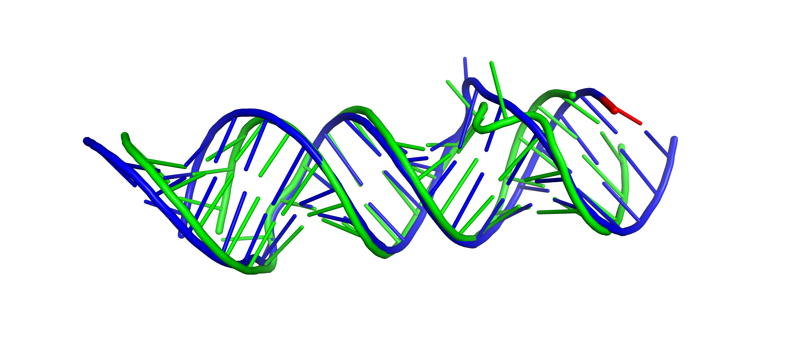
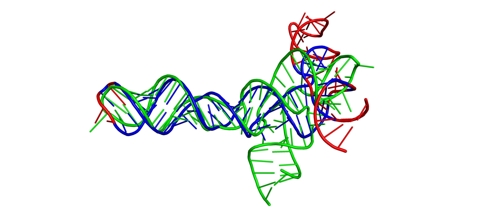
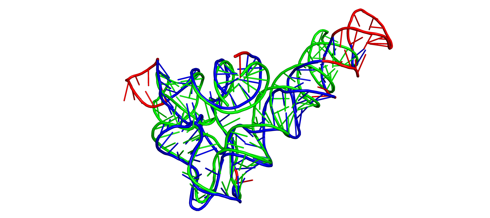

# RNA Structure Aligner

Information about the project, results and included algorithms can be found here: [Thesis](https://drive.google.com/open?id=17tl4rKGbjy284WpHZ5hWgyhpB6T08-vA)

The proposed approaches are heuristic algorithms that in practice generate
suboptimal solutions of expected quality. One of the advantages of GENS is
that it is able to generate multiple alternative alignments sometimes
aligning different fragments of considered structures. Otherwise, GEOS is
a dedicated heuristic that is usually repeatable for the particular pair
of 3D structures and the given values of configuration parameters, the final
results can differ depending if time limit was triggered or not.

# Build

Please run:

    ./build.sh
    
or

    mvn package

`Java` and `Maven` are required to build the project.

Tested with:
Java 11 + Maven 3.6.3

# Usage

RNA Hugs is a command line application, which requires to be provided
with:

-   `--reference` and the path to reference PDB file.
-   `--target` and the path to target PDB file.


```
java -jar target/rna-hugs-X.Y-jar-with-dependencies.jar --reference reference.pdb --target target.pdb --method genetic --rmsd 2

usage: java -jar rna-hugs.jar -r <reference.pdb> -t <target.pdb> [OPTIONS]
    --allow-incomplete            (optional) Allow usage of incomplete atoms in coarse-grained
                                  structure creation. By default, all of the atoms specified in the
                                  code are required to include molecule in calculations.
    --geometric-pop               (optional) Generate initial population using first results
                                  obrained from the geometric algorithm.
    --input-format <format>       (optional) Format type of both input structures. Auto allows for
                                  different formats between target and reference
                                  Available: auto, pdb, cif
                                  Default: auto
 -m,--method <method>             (optional) Method used to align input structures.
                                  Available: geometric, genetic
                                  Default: geometric
    --mode <aligning-mode>        (optional) Aligning mode used with each method. Can be either
                                  sequence independent or sequence dependent
                                  Available: seq-indep, seq-dep
                                  Default: seq-indep
 -o,--output <path>               (optional) Output directory for all results and alignements.
                                  Default: use directory of target structure
    --pair-rmsd <rmsd>            (optional) Maximum RMSD (in Ångström) that cores with 2
                                  nucleotides will not exceed. Increase leads to wider and longer
                                  search. Must be lower or equal to triple-rmsd.
                                  Default: 0.65
    --pop-size <size>             (optional) Population size for each generation and thread
                                  Default: 200
 -r,--reference <reference.pdb>   Reference structure in .pdb/.cif format. Can force format with
                                  --input-format
    --rmsd <rmsd>                 (optional) Maximum RMSD (in Ångström) that the aligned fragment
                                  will not exceed.
                                  Default: 3.5
 -t,--target <target.pdb>         Target structure in .pdb/.cif format. Can force format with
                                  --input-format
    --threads <threads>           (optional) Number of threads used by algoritm. Easy way to speedup
                                  the processing.
                                  Default: all system threads
    --time-limit <seconds>        (optional) Maximum execution time in seconds before program
                                  returns. Execution time can be well below set value if no
                                  improvements are found for long time.
                                  Default: 300
    --triple-rmsd <rmsd>          (optional) Maximum RMSD (in Ångström) that cores with 3
                                  nucleotides will not exceed. Increase leads to wider and longer
                                  search. Must be higher or equal to pair-rmsd.
                                  Default: 1.0
```

**Warning - currently included .pdb parser was written just for the sake of showing basic functionality and should not be used  outside of this project!.**

# Methods

Both methods require coarse-grained structures as an input for alignment!</br>
Required RMSD and number of threads can be specified in AlignerConfig structure which also contains method-specific configurations.

- genetic - GeneticAligner, uses genetic metaheuristic, multithreaded. 
- geometric - GeometricAligner. Strong mathematical roots with greedy expansion of the kernel.

# Configuration

Both algorithms be further configured and fine adjusted. Configs are located in `AlignerConfig.java` file / `AlignerConfig` class.

Explanation of more important config parameters.

### General
    threads              - Number of threads used by algoritm. Easy way to speedup the processing.
    rmsdLimit            - Maximum RMSD of the aligned structure fragment. 
                           Same as 'rmsd-threshold' when using the program.
    returnTime           - Maximum execution time in seconds before program returns.
                           Execution time can be well below set value if no improvements 
                           are found for up to 'waitBuffer' time.
    waitBufferPercentage - Maximum time allowed without improvement to the result.
    waitBufferFlat       - Minimum allowed time without improvement to the result.

### Geometric
    pairRmsdLimit   - How similar (RMSD) should the dual nucleotide alignments be.
    tripleRmsdLimit - How similar should the triples (full cores) of nucleotide alignments be. 
    dualCoreBatches - How many batches of 2 nucleotide cores should be made.
                      High value means cores will have to be recalculated more times
                      but the overall RAM requirement will decrease.

### Genetic
    geometricPopulation - Use Geometric method to generate initial population for Genetic.
                          This can (it can also slow it down) speed up the final result generation.
                          This removes a large portion of randomness which can be detrimental to 
                          generating different results.
    resetThreadTime     - Time without improvement to the population for thread (one population size) to restart
                          and regenerate the population and start again.
    bestPercentage      - How many best specimens from each generation should be moved to the next one.
                          Increase can improve speed of improving the result but can limit the total search 
                          scope which can lead to lower final alignment.
    populationSize      - Number of speciments in the population. The higher the value the longer it takes for
                          each epoch but should provide better search scope and mixing of specimens.

# Examples

To compare results and performance of different methods and aligning modes please run:

    ./run_examples.sh
    
Binaries obtained from running `./build.sh` are required to run examples script.

Note: The results can vary from run to run. The GEOS results should vary slightly at most
as time limit is the only limiting factor here that can change if the search of the whole 
space was finished or now. The GENS result can differe more, positively and negatively,
due to nondeterministic nature of metaheuristic algorithm and randomness.

Visualization of example alignments done using PyMOL.

Examples show model structure superimposed over target structure. 
Presented result use sequence independent mode of geometric algorithm with 3.5 RMSD cutoff.

Blue - Aligned fragment of the model structure.

Red - Not aligned fragment of the model structure.

Green - Target structure.

## Puzzle 01 - Das_3 model vs 3MEI (target) - Aligned 45/46


<details>
<summary>
Click to see the output
</summary>

``` 
Aligning mode: sequence-independent
Maximal RMSD threshold: 3.50
Residues number of reference structure: 46
Residues number of model: 46
Number of aligned nucleotides: 45
RMSD score: 3.423
Processing time [ms]: 11132

REF:   CCGCCGCGCCAUGCCUGUGGCGGCCGCCGCGCCAUGCCUGUGGCGG
       ||||||||||||||||||||||||||||||| ||||||||||||||
MODEL: CCCCGGCGCCAUGCCUGUGGCGGCGCCGCGC-CAUGCCUGUGGCGG
    
REF  	<->	MODEL
A1 	<->	A1 
A2 	<->	A2 
A3 	<->	A4 
A4 	<->	A5 
A5 	<->	A3 
A6 	<->	A6 
A7 	<->	A7 
A8 	<->	A8 
A9 	<->	A9 
A10 	<->	A10 
A11 	<->	A11 
A12 	<->	A12 
A13 	<->	A13 
A14 	<->	A14 
A15 	<->	A15 
A16 	<->	A16 
A17 	<->	A17 
A18 	<->	A18 
A19 	<->	A19 
A20 	<->	A20 
A21 	<->	A21 
A22 	<->	A22 
A23 	<->	A23 
B1 	<->	B2 
B2 	<->	B3 
B3 	<->	B4 
B4 	<->	B5 
B5 	<->	B6 
B6 	<->	B7 
B7 	<->	B8 
B8 	<->	B9 
B9 	<->	-
B10 	<->	B10 
B11 	<->	B11 
B12 	<->	B12 
B13 	<->	B13 
B14 	<->	B14 
B15 	<->	B15 
B16 	<->	B16 
B17 	<->	B17 
B18 	<->	B18 
B19 	<->	B19 
B20 	<->	B20 
B21 	<->	B21 
B22 	<->	B22 
B23 	<->	B23
```

</details>

## Puzzle 03 - Chen_1 model vs 3OWZ (target) - Aligned 53/84


<details>
<summary>
Click to see the output
</summary>

``` 
Aligning mode: sequence-independent
Maximal RMSD threshold: 3.50
Residues number of reference structure: 84
Residues number of model: 84
Number of aligned nucleotides: 53
RMSD score: 3.440
Processing time [ms]: 18858
    
REF:   CUCUGGAGAGAACCGUUUAAUCGGUCGCCGAAGGAGCAAGCUCUGCGGAAACGCAGAGUGAAACUCUCAGGCAAAAGGAC
              || |||||| |  |||| |||  ||||||||||||||||||    ||||||| || ||||||||||       
MODEL: -------GC-AGACCU-A--CGGU-CGC--AAGGAGCAGCUCUGCGCU----AUGCAGA-GA-ACUCUCAGGC-------

REF:   AGAG
           
MODEL: ----
    
REF  	<->	MODEL
A1 	<->	-
A2 	<->	-
A3 	<->	-
A4 	<->	-
A5 	<->	-
A6 	<->	-
A7 	<->	-
A8 	<->	A30 
A9 	<->	A29 
A10 	<->	-
A11 	<->	A73 
A12 	<->	A10 
A13 	<->	A12 
A14 	<->	A13 
A15 	<->	A14 
A16 	<->	A18 
A17 	<->	-
A18 	<->	A20 
A19 	<->	-
A20 	<->	-
A21 	<->	A22 
A22 	<->	A23 
A23 	<->	A24 
A24 	<->	A25 
A25 	<->	-
A26 	<->	A26 
A27 	<->	A27 
A28 	<->	A28 
A29 	<->	-
A30 	<->	-
A31 	<->	A31 
A32 	<->	A32 
A33 	<->	A33 
A34 	<->	A34 
A35 	<->	A35 
A36 	<->	A36 
A37 	<->	A37 
A38 	<->	A39 
A39 	<->	A40 
A40 	<->	A41 
A41 	<->	A42 
A42 	<->	A43 
A43 	<->	A44 
A44 	<->	A45 
A45 	<->	A46 
A46 	<->	A47 
A47 	<->	A48 
A48 	<->	A50 
A49 	<->	-
A50 	<->	-
A51 	<->	-
A52 	<->	-
A53 	<->	A51 
A54 	<->	A52 
A55 	<->	A53 
A56 	<->	A54 
A57 	<->	A55 
A58 	<->	A56 
A59 	<->	A57 
A60 	<->	-
A61 	<->	A60 
A62 	<->	A62 
A63 	<->	-
A64 	<->	A63 
A65 	<->	A64 
A66 	<->	A65 
A67 	<->	A66 
A68 	<->	A67 
A69 	<->	A68 
A70 	<->	A69 
A71 	<->	A70 
A72 	<->	A71 
A73 	<->	A72 
A74 	<->	-
A75 	<->	-
A76 	<->	-
A77 	<->	-
A78 	<->	-
A79 	<->	-
A80 	<->	-
A81 	<->	-
A82 	<->	-
A83 	<->	-
A84 	<->	-
```

</details>

## Puzzle 04 - Adamiak_4 model vs 3V7E (target) 97/126


<details>
<summary>
Click to see the output
</summary>

``` 
Maximal RMSD threshold: 3.50
Residues number of reference structure: 126
Residues number of model: 126
Number of aligned nucleotides: 97
RMSD score: 3.468
Processing time [ms]: 32978
    
REF:   GGCUUAUCAAGAGAGGUGGAGGGACUGGCCCGAUGAAACCCGGCAACCACUAGUCUAGCGUCAGCUUCGGCUGACGCUAG
       ||||||||||||||||||||||||||||||||||||||||||||||| ||||||    || |             |||||
MODEL: GGCUUAUCAAGAGAGGUGGAGGGACUGGCCCGAUGAAACCCGGCAAC-CCUAUU----AG-U-------------CUAGG

REF:   GCUAGUGGUGCCAAUUCCUGCAGCGGAAACGUUGAAAGAUGAGCCA
       |  |||||||||||||||||||||        ||||||||||||||
MODEL: C--AGUGGUGCCAAUUCCUGCAGU--------UGAAAGAUGAGCCA
    
REF  	<->	MODEL
A1 	<->	A1 
A2 	<->	A2 
A3 	<->	A3 
A4 	<->	A4 
A5 	<->	A5 
A6 	<->	A6 
A7 	<->	A7 
A8 	<->	A8 
A9 	<->	A9 
A10 	<->	A10 
A11 	<->	A11 
A12 	<->	A12 
A13 	<->	A13 
A14 	<->	A14 
A15 	<->	A15 
A16 	<->	A16 
A17 	<->	A17 
A18 	<->	A18 
A19 	<->	A19 
A20 	<->	A20 
A21 	<->	A21 
A22 	<->	A22 
A23 	<->	A23 
A24 	<->	A24 
A25 	<->	A25 
A26 	<->	A26 
A27 	<->	A27 
A28 	<->	A28 
A29 	<->	A29 
A30 	<->	A30 
A31 	<->	A31 
A32 	<->	A32 
A33 	<->	A33 
A34 	<->	A34 
A35 	<->	A35 
A36 	<->	A36 
A37 	<->	A37 
A38 	<->	A38 
A39 	<->	A39 
A40 	<->	A40 
A41 	<->	A41 
A42 	<->	A42 
A43 	<->	A43 
A44 	<->	A44 
A45 	<->	A45 
A46 	<->	A46 
A47 	<->	A47 
A48 	<->	-
A49 	<->	A48 
A50 	<->	A50 
A51 	<->	A51 
A52 	<->	A52 
A53 	<->	A83 
A54 	<->	A54 
A55 	<->	-
A56 	<->	-
A57 	<->	-
A58 	<->	-
A59 	<->	A57 
A60 	<->	A58 
A61 	<->	-
A62 	<->	A72 
A63 	<->	-
A64 	<->	-
A65 	<->	-
A66 	<->	-
A67 	<->	-
A68 	<->	-
A69 	<->	-
A70 	<->	-
A71 	<->	-
A72 	<->	-
A73 	<->	-
A74 	<->	-
A75 	<->	-
A76 	<->	A55 
A77 	<->	A56 
A78 	<->	A79 
A79 	<->	A80 
A80 	<->	A81 
A81 	<->	A82 
A82 	<->	-
A83 	<->	-
A84 	<->	A84 
A85 	<->	A85 
A86 	<->	A86 
A87 	<->	A87 
A88 	<->	A88 
A89 	<->	A89 
A90 	<->	A90 
A91 	<->	A91 
A92 	<->	A92 
A93 	<->	A93 
A94 	<->	A94 
A95 	<->	A95 
A96 	<->	A96 
A97 	<->	A97 
A98 	<->	A98 
A99 	<->	A99 
A100 	<->	A100 
A101 	<->	A101 
A102 	<->	A102 
A103 	<->	A103 
A104 	<->	A112 
A105 	<->	-
A106 	<->	-
A107 	<->	-
A108 	<->	-
A109 	<->	-
A110 	<->	-
A111 	<->	-
A112 	<->	-
A113 	<->	A113 
A114 	<->	A114 
A115 	<->	A115 
A116 	<->	A116 
A117 	<->	A117 
A118 	<->	A118 
A119 	<->	A119 
A120 	<->	A120 
A121 	<->	A121 
A122 	<->	A122 
A123 	<->	A123 
A124 	<->	A124 
A125 	<->	A125 
A126 	<->	A126 
```

</details>

# Output 
Both methods output AlignerOutput structure.

- **aligned** - How many nucleotides were aligned within RMSD limit.
- **referenceIndexes** - Indexes of the reference structure that were used for the alignment.
- **targetMapping** - Indexes of the target structure to which were reference structure was mapped. Index *i-th* nucleotide in **referenceIndexes** is linked to the *i-th* nucleotide in **targetMapping**.
- **superimposer** - Superimposer structure. It contains final shift and rotation matrices that can be used to align the whole structure. Main structure and required functions were rewritten from BioJava SVDSuperimposer implementation to enable more lightweight 'Coordinates' structure instead of 'Atom'.
